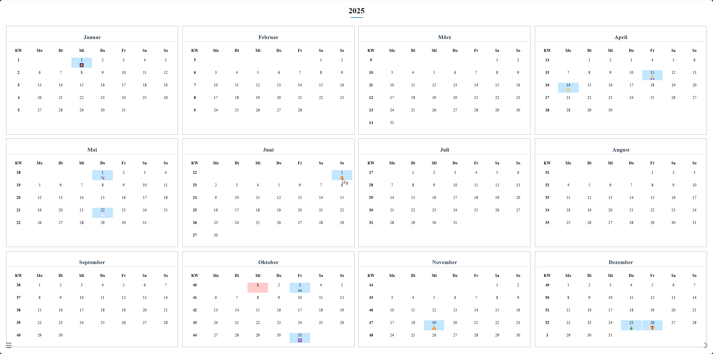

# Calendar PWA (UNI Project)

A Progressive Web App (PWA) calendar application — developed as a frontend project for university.  
This app allows users to view dates, holidays, and perform basic date-related functions in a web-based, offline-capable calendar.

---

## 🎯 Purpose & Goals

- Create a **responsive and offline-capable** calendar web app  
- Display public holidays (Feiertage) via a JSON data source  
- Enable smooth navigation between months and years  
- Implement PWA features: installability, caching, service workers  
- Keep UI simple, clean, and user-friendly  

---

## 🧱 Repository Structure

Here’s how the project is organized:

```markdown
.
├── 📁 icons/ # App icons (for PWA, manifest)
├── 📄 index.html # Main HTML page
├── 📄 style.css # Stylesheet
├── 📄 app.js # Main JavaScript logic
├── 📄 service-worker.js # Service worker script for PWA offline support
├── 📄 manifest.json # Web app manifest (icons, metadata)
└── 📄 feiertage.json # JSON file with public holidays data
```

---


## 🏗 Tech Stack & Features

- **Frontend:** HTML, CSS, JavaScript  
- **PWA:** service workers, manifest, caching strategies  
- **Data:** Static JSON (`feiertage.json`) with holiday entries  
- **Icons & App Identity:** Uses `icons/` folder + manifest configuration  
- **Responsive Design:** Works across desktop and mobile  
- **Offline Usage:** After first load, app should work (with some limitations) when offline  

---

## 📸 Screenshots & Demo

Below are some visuals of the application (you should replace these placeholders with your actual images / GIFs):

### 🗓 Calendar View

<p align="center">
  
  
</p>
*(Monthly calendar layout, highlighting holidays)*

---

## 🎯Next Steps & Future Improvements

- Add multi-language support (English)
- Integrate a live holiday API for dynamic data
- Improve error handling and user feedback
- Add dark mode / theme support
- Enhance caching strategy for updates

---
